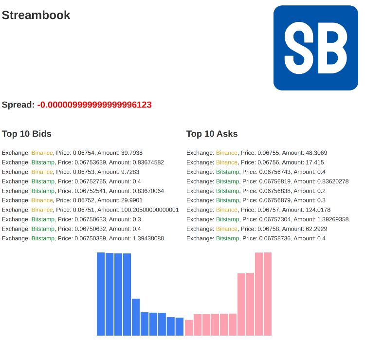

# Streambook

This is a mini project written in Rust that connects to two exchanges' WebSocket feeds
simultaneously, pulls order books for a given traded pair of currencies from each
exchange, merges and sorts the order books to create a combined order book, and
publishes the spread, top ten bids, and top ten asks as a stream through a gRPC server.



## Requirements
Rust (version 1.5 or later)

## Installation

1. Clone the repository:

   ```bash
   git clone https://github.com/mbarth/stream-book.git
   ```
2. Change to the project directory:

    ```bash
    cd stream-book
    ```

3. Build the project:

    ```bash
    cargo build --release
    ```
   
## Usage

1. The `local.toml` file under the `/config` directory holds the current URLs for the two 
   exchanges. Make any changes necessary if you would like a different currency pair.
   
    ```toml
    [exchanges.first_exchange.websocket]
    address = "wss://stream.binance.com:9443/ws/ethbtc@depth20@100ms"
    
    [exchanges.second_exchange.websocket]
    address = "wss://ws.bitstamp.net"
    event = "bts:subscribe"
    channel = "order_book_ethbtc"
    ```

2. Start the gRPC server:

    ```bash
    cargo run --release
    ```

3. The gRPC server will be running and ready to accept client connections. You can now 
   connect to the server and consume the streaming spread, top ten bids, and top ten asks.
   The [grpcurl](https://github.com/fullstorydev/grpcurl) utility is an easy way to connect
   and test the gRPC server endpoints.
   
   ```bash
   # using reflection
   grpcurl -d '{}' -plaintext localhost:50051 orderbook.OrderbookAggregator/BookSummary
   
   # under the project's root directory and using the protobuf file
   grpcurl -plaintext -import-path ./proto -proto orderbook.proto -d '{}' 'localhost:50051' orderbook.OrderbookAggregator/BookSummary
   ```
   
4. Alternatively, there is a websocket endpoint available that returns similar data. The 
   [websocat](https://github.com/vi/websocat) utility is a simple client to view the results
   from the websocket endpoint.
   
   ```bash
   websocat ws://localhost:8080/ws
   ```
   
5. Lastly, there is a webpage built using the websocket endpoint available at http://localhost:8080
   that can be used to visualize the results.
   
6. To stop the server, issue a `ctrl+c` command in the same terminal where the service was started.

## Testing Instructions

1. To run the unit tests:

   ```bash
   cargo test
   ```
   
## Technical Approach and Assumptions

* This is a reporting exercise without order matching, updates, and cancellations. Bids and 
  asks are collected from two exchanges and will accumulate results, not reflecting the most
  recent items, unless there is some clearing mechanism implemented. To address this, a 
  configurable flush interval is used to periodically clear the bids and asks. This ensures 
  that the results returned are based on the latest received data, minimizing any potential 
  skewing effects. The flush interval is used [here](https://github.com/mbarth/stream-book/blob/master/src/ws_data_providers/ws_listeners.rs#L119).
  
* The gRPC and web socket services are configurable but it helps to understand what occurs when
  changing them. For example, if going with the straightforward setup described in the technical
  challenge write up, then there will be a total of 120 combined messages received at one time.
  Bitstamp by default returns 100 and Binance (which depends on the URL `depth` setting) returns 
  20 if using the URL described in the technical challenge:
  
  ```
  wss://stream.binance.com:9443/ws/ethbtc@depth20@100ms
  ```
  Therefore, you can safely ask for the 100 top bids and asks using the `websocket_flush_threshold` 
  setting of 121: 100 results from bitstamp + 20 from binance + 1 extra triggering flush of results.
    
  ```
  websocket_interval_millis = 600
  top_bids_and_asks_count = 100
    
  [deploy]
  env = "local"
    
  [exchanges]
  # represents 100 results from bitstamp + 20 from binance + 1 extra triggering flush of results
  # basically flushing on every 2nd iteration of combined results received
  websocket_flush_threshold = 121
  ```
  
* The design of the websocket endpoint and corresponding HTML reporting page brought up an 
  important consideration. The gRPC service streams messages continuously without delay, which 
  heavily utilizes the Read guard. To minimize contention with the Read guard on the websocket, 
  I introduced a delay when reading results on the websocket service. This delay is implemented 
  because the results are consumed visually on a webpage, allowing for a slightly delayed 
  presentation. Setting a very low `websocket_interval_millis`, such as `50`, makes it 
  challenging to capture quickly changing results. On the other hand, a value of around `600` 
  to `750` makes it easier to view the results. You are welcome to experiment with these values: 
  decrease the default `websocket_interval_millis` setting to something lower and increase the 
  default `top_bids_and_asks_count` to as high as `100`.

* The same bids/asks price levels, with the same amounts, can come from each exchange on 
  subsequent intervals. To ensure there are no duplicate entries affecting the results, 
  previously collected entries are removed. An example of the logic to remove duplicate entries 
  can be found [here](https://github.com/mbarth/stream-book/blob/master/src/ws_data_providers/ws_listeners.rs#L100).

* There is the possibility of both exchanges sending the same price level at the same time interval,
  yet the question is what exchange should the price level be reported to? This is managed by 
  reporting the same price level to both exchanges using an `exchange:price_level` key in a hashmap 
  rather than just price level. This hashmap holds bids/asks received temporarily before they're sorted. 
  Here are links to an example for [bids](https://github.com/mbarth/stream-book/blob/master/src/order_book/model.rs#L89) 
  and one for [asks](https://github.com/mbarth/stream-book/blob/master/src/order_book/model.rs#L105).
  The sorting first considers price and then system time received so there will always be a 
  winner. The take-away is, there exists the possibility of seeing results like this:
  
   ```
   "asks": [
   { exchange: "binance", price: 8491.25, amount: 0.008 },
   { exchange: "coinbase", price: 8491.25, amount: 0.0303 },
   ...
   ]
   ```
  
* Regarding error handling, it is important to note the approach I followed. Typically, when working 
  with long-lived threads, I prefer to continue processing even when errors occur, if feasible. 
  Instead of panicking, I tend to report errors through services like NewRelic or Sentry, enabling 
  further action to be taken. For this challenge, I heavily relied on the `anyhow` crate to simplify 
  the error handling implementation.
  
* I made an effort to implement unit tests wherever possible. However, testing the exchange 
  websocket client listeners posed challenges in setting up mock servers and clients. Similarly, 
  testing the websocket service was not a straightforward task. In my previous experience, I have 
  been successful in testing API endpoints. In cases where mocking became complex and cumbersome, 
  I resorted to manual testing.
  
## Credit

* Thanks to [@idibidiart](https://gist.github.com/idibidiart/42e8abf6fde52f54cec58064f9fd5582) for 
  a sample of how to render the bids/asks chart using [D3.js](https://d3js.org/). I modified their
  D3 chart code to work with streaming websocket data.

* Thanks to [@dgtony](https://github.com/dgtony/orderbook-rs/tree/master) for their ordering logic,
  lines [18-53](https://github.com/dgtony/orderbook-rs/blob/master/src/engine/order_queues.rs#L18-L53).
  I modified it [slightly](https://github.com/mbarth/stream-book/blob/master/src/order_book/model.rs#L30-L66) 
  but the logic is basically the same.
